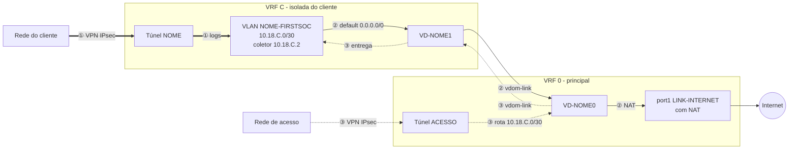
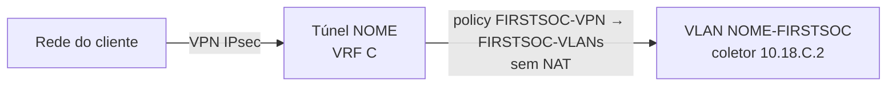
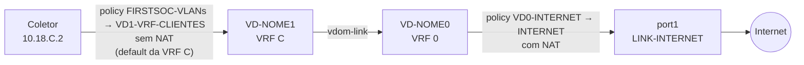
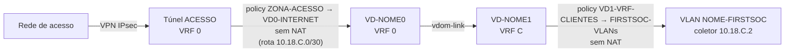

# Onboarding de novo cliente — FGT-FIRSTSOC

Runbook para subir um cliente novo no FortiGate VM **FGT-FIRSTSOC** (FortiOS 7.4): VLAN, VPN IPsec, VRF, vdom-link, zones, rotas e policies.

## Legenda

Todos os nomes e números específicos de cliente foram trocados por variáveis.

| Variável | Significado | Exemplo de uso |
|---|---|---|
| `C` | Número do cliente. É a **VRF** e também o **ID da VLAN** | `10.18.C.0/30` |
| `NOME` | Sigla do cliente | `VD-NOME0` |
| `IP_PEER` | IP público do equipamento do cliente | `set remote-gw IP_PEER` |
| `REDE_REMOTA` / `MASCARA` | Rede do cliente que chega pela VPN | `set subnet REDE_REMOTA MASCARA` |
| `PSK` | Chave pré-compartilhada da VPN | `set psksecret PSK` |
| `ACESSO` | VPN de acesso que termina na **VRF 0** e consulta os coletores | `ZONA-ACESSO` |

---

## 1. Arquitetura e objetivo

### Objetivo

Cada cliente fica em uma **VRF própria**. O cliente chega pela VPN IPsec e envia dados (syslog, etc.) para o host coletor dele na VLAN dedicada. Esse host também precisa de internet, que só existe na **VRF 0**.

O desenho resolve três requisitos:

- **Isolamento entre clientes**, em duas camadas que funcionam juntas: cada cliente tem a sua VRF, e a zone `VD0-INTERNET` usa `intrazone deny`. A segunda camada é essencial: todas as pontas `0` dos vdom-links ficam na VRF 0, que conhece a `/30` de cada cliente. Sem o `intrazone deny`, um cliente alcançaria outro passando pela VRF 0.
- **Saída de internet compartilhada**: todos os clientes saem pela `port1` (LINK-INTERNET), com NAT, a partir da VRF 0.
- **Acesso aos coletores** pela VPN de acesso, que termina na VRF 0.

### Por que vdom-link

No FortiOS 7.4, a rota estática **não tem campo `vrf`** (ele só existe para rota blackhole). A rota sempre entra na VRF da interface de saída. Uma default apontando para a `port1` fica, portanto, só na VRF 0, e a VRF do cliente não teria internet.

A solução é um **vdom-link por cliente dentro do mesmo VDOM** (root), funcionando como um "cabo virtual" entre as VRFs:

- Ponta `0` na **VRF 0**.
- Ponta `1` na **VRF C** (a do cliente).
- **Sem IP** nas pontas. As duas ficam no mesmo VDOM, e com IP o FortiOS acusa sub-rede sobreposta. Sem IP, as rotas usam só a interface.

### Mapa do tráfego

Existem **três caminhos**. Cada um tem um número e um estilo de linha diferente, para não depender só da cor:

| Nº | Caminho | Estilo no mapa |
|---|---|---|
| ① | Cliente → VPN → VLAN do coletor | Linha grossa |
| ② | Coletor → internet | Linha contínua |
| ③ | VPN de acesso → VLAN do coletor | Linha pontilhada |



> O **underlay** dos túneis (IKE/ESP) sai pela `port1`, na VRF 0. Só o tráfego **dentro** do túnel do cliente fica na VRF C. O lado do cliente **não precisa de VRF**.

### Caminho ① — cliente envia logs ao coletor

Não passa pelo vdom-link: tudo acontece dentro da VRF C.



### Caminho ② — coletor sai para a internet

Atravessa o vdom-link da VRF C para a VRF 0 e sai com NAT.



A volta usa a mesma sessão. A rota `10.18.C.0/30 via VD-NOME0` na VRF 0 é obrigatória; sem ela o pacote cai no *reverse path check*.

### Caminho ③ — VPN de acesso chega ao coletor

Sentido inverso ao ②: entra pela VRF 0 e desce para a VRF C pelo vdom-link, sem NAT.



O coletor enxerga o IP real da rede de acesso (sem NAT) e responde pelo gateway dele, `10.18.C.1`.

### Resumo dos caminhos

| Nº | Entra por | Sai por | Usa vdom-link | Policies | NAT |
|---|---|---|---|---|---|
| ① | Túnel NOME (VRF C) | VLAN NOME-FIRSTSOC | Não | `FIRSTSOC-VPN` → `FIRSTSOC-VLANs` | Não |
| ② | VLAN NOME-FIRSTSOC | port1 | Sim (VRF C → 0) | `FIRSTSOC-VLANs` → `VD1-VRF-CLIENTES`; `VD0-INTERNET` → `INTERNET` | Só na saída |
| ③ | Túnel ACESSO (VRF 0) | VLAN NOME-FIRSTSOC | Sim (VRF 0 → C) | `ZONA-ACESSO` → `VD0-INTERNET`; `VD1-VRF-CLIENTES` → `FIRSTSOC-VLANs` | Não |

### Zones

As policies são por **zone** e já existem. O cliente novo só precisa entrar nas zones para herdar as regras.

| Zone | Membros | Papel |
|---|---|---|
| `FIRSTSOC-VPN` | Túneis dos clientes | Origem do tráfego dos clientes |
| `FIRSTSOC-VLANs` | VLANs dos coletores | Destino dos logs / origem para a internet |
| `VD1-VRF-CLIENTES` | Pontas `1` dos vdom-links | Entrada no vdom-link (VRF do cliente) |
| `VD0-INTERNET` | Pontas `0` dos vdom-links | Saída do vdom-link (VRF 0) |
| `INTERNET` | `port1` | Saída para a internet |
| `ZONA-ACESSO` | Túnel da VPN de acesso | Origem do caminho ③ |

Todas as zones usam `intrazone deny`. **Não altere** em `VD0-INTERNET`: é ela que impede um cliente de alcançar outro pela VRF 0.

### Convenções

| Item | Padrão |
|---|---|
| VRF | `C`, igual ao ID da VLAN. Único por cliente (1 a 251) |
| VLAN | `NOME-FIRSTSOC` na `port2`, ID `C` |
| IP da VLAN | `10.18.C.1/30` no FortiGate, `10.18.C.2` no coletor |
| Túnel | `NOME`, na `port1` |
| Redes remotas | Address group `NOME-REDES` |
| vdom-link | `VD-NOME` (pontas `VD-NOME0` e `VD-NOME1`) |

---

## 2. Passo a passo

Substitua `C`, `NOME`, `IP_PEER`, `REDE_REMOTA`, `MASCARA` e `PSK` conforme a legenda.

Antes de começar, faça backup e confirme que a VRF `C` está livre:

```
show system interface | grep -f "set vrf C"
```

### Passo 1 — VLAN

```
config system interface
    edit "NOME-FIRSTSOC"
        set vdom "root"
        set vrf C
        set ip 10.18.C.1 255.255.255.252
        set allowaccess ping
        set interface "port2"
        set vlanid C
    next
end
```

### Passo 2 — VPN IPsec

Redes remotas:

```
config firewall address
    edit "NOME-NET1"
        set subnet REDE_REMOTA MASCARA
        set allow-routing enable
    next
end
config firewall addrgrp
    edit "NOME-REDES"
        set member "NOME-NET1"
        set allow-routing enable
    next
end
```

Túnel (proposta e DH combinados com o cliente):

```
config vpn ipsec phase1-interface
    edit "NOME"
        set interface "port1"
        set ike-version 2
        set peertype any
        set net-device disable
        set proposal aes256-sha256
        set dhgrp 14
        set remote-gw IP_PEER
        set psksecret PSK
    next
end

config vpn ipsec phase2-interface
    edit "NOME-P2"
        set phase1name "NOME"
        set proposal aes256-sha256
        set dhgrp 14
        set src-addr-type subnet
        set src-subnet 10.18.C.0 255.255.255.252
        set dst-addr-type name
        set dst-name "NOME-REDES"
    next
end

config system interface
    edit "NOME"
        set vrf C
    next
end
```

### Passo 3 — vdom-link

```
config system vdom-link
    edit "VD-NOME"
    next
end

config system interface
    edit "VD-NOME0"
        set vdom "root"
        set vrf 0
        set allowaccess ping
    next
    edit "VD-NOME1"
        set vdom "root"
        set vrf C
        set allowaccess ping
    next
end
```

### Passo 4 — Zones

Use `append`. O comando `set interface` substitui a lista e tira os outros clientes da zone.

```
config system zone
    edit "FIRSTSOC-VLANs"
        append interface "NOME-FIRSTSOC"
    next
    edit "FIRSTSOC-VPN"
        append interface "NOME"
    next
    edit "VD0-INTERNET"
        append interface "VD-NOME0"
    next
    edit "VD1-VRF-CLIENTES"
        append interface "VD-NOME1"
    next
end
```

### Passo 5 — Rotas

```
config router static
    edit 0
        set dstaddr "NOME-REDES"
        set device "NOME"
        set comment "VPN - NOME"
    next
    edit 0
        set device "VD-NOME1"
        set comment "INTERNET - NOME"
    next
    edit 0
        set dst 10.18.C.0 255.255.255.252
        set device "VD-NOME0"
        set comment "ROTA - VLAN NOME"
    next
end
```

| Rota | Fica na VRF | Para quê |
|---|---|---|
| `NOME-REDES` via `NOME` | `C` | Caminho ①: redes do cliente pela VPN |
| `0.0.0.0/0` via `VD-NOME1` | `C` | Caminho ②: internet do coletor |
| `10.18.C.0/30` via `VD-NOME0` | `0` | Retorno do ② e entrada do ③ |

### Passo 6 — Policies

Nada a criar: o cliente já entra nas policies por zone. Só confira que existem as dos três caminhos:

```
show firewall policy | grep -f FIRSTSOC
show firewall policy | grep -f VD0-INTERNET
show firewall policy | grep -f ZONA-ACESSO
```

### Passo 7 — Validar

```
diagnose vpn tunnel list name NOME
get router info routing-table details 8.8.8.8
get router info routing-table details 10.18.C.2
```

Esperado: `VRF=C` com `0.0.0.0/0 via VD-NOME1` e `VRF=0` com `10.18.C.0/30 via VD-NOME0`.

Teste do caminho ② a partir do coletor (`nslookup google.com 8.8.8.8` no `10.18.C.2`):

```
diagnose debug flow filter clear
diagnose debug flow filter saddr 10.18.C.2
diagnose debug flow filter daddr 8.8.8.8
diagnose debug flow show function-name enable
diagnose debug flow trace start 20
diagnose debug enable
```

Esperado: primeiro `via VD-NOME1`, depois `via port1`. Ao terminar: `diagnose debug disable`.

Teste de isolamento: de `10.18.C.2`, tente alcançar o coletor de **outro** cliente. Deve falhar. Se passar, confira `intrazone deny` em `VD0-INTERNET`:

```
show system zone VD0-INTERNET
```

---

## 3. Troubleshooting

| Sintoma no flow debug | Causa | Correção |
|---|---|---|
| `no route` na VRF do cliente | Falta a default via `VD-NOME1` | Passo 5 |
| `reverse path check fail` | Falta o retorno `/30` via `VD-NOME0` | Passo 5 |
| `denied by policy 0` | Interface fora da zone, ou NAT antes do vdom-link | Passo 4 / policies |
| Caminho ③ falha no 1º salto | Falta policy `ZONA-ACESSO` → `VD0-INTERNET` | Passo 6 |
| Caminho ③ falha no 2º salto | Falta policy `VD1-VRF-CLIENTES` → `FIRSTSOC-VLANs` | Passo 6 |
| Túnel up, sniffer vazio | Selector ou rota errada no lado do cliente | Conferir phase2 dos dois lados |
| TCP responde `[R.]` | Serviço do coletor recusa a porta | Verificar o serviço, não a rede |

## 4. Boas práticas

- **VRF e `/30` únicas por cliente.** As redes remotas podem repetir entre clientes, porque ficam só na VRF de cada um.
- **Mantenha `intrazone deny` em `VD0-INTERNET`.** Ele é a barreira entre clientes na VRF 0.
- **Nunca ligar NAT** nas policies `FIRSTSOC-VLANs` → `VD1-VRF-CLIENTES`, `ZONA-ACESSO` → `VD0-INTERNET` e `VD1-VRF-CLIENTES` → `FIRSTSOC-VLANs`. NAT só em `VD0-INTERNET` → `INTERNET`.
- **Blackhole recomendado.** Sem ele, se o túnel cair, o tráfego para as redes do cliente sai pela default para a internet:

  ```
  config router static
      edit 0
          set dstaddr "NOME-REDES"
          set blackhole enable
          set distance 254
          set vrf C
          set comment "BLACKHOLE - NOME"
      next
  end
  ```

- **Cliente com perfil próprio** (web filter, IP de NAT, banda): deixe as interfaces dele fora das zones e crie policies dedicadas.

## 5. Rollback

Ordem inversa da criação:

```
# 1. Rotas: delete as três entradas com comment "NOME" em config router static

# 2. Zones
config system zone
    edit "FIRSTSOC-VLANs"
        unselect interface "NOME-FIRSTSOC"
    next
    edit "FIRSTSOC-VPN"
        unselect interface "NOME"
    next
    edit "VD0-INTERNET"
        unselect interface "VD-NOME0"
    next
    edit "VD1-VRF-CLIENTES"
        unselect interface "VD-NOME1"
    next
end

# 3. vdom-link
config system vdom-link
    delete "VD-NOME"
end

# 4. VPN
config vpn ipsec phase2-interface
    delete "NOME-P2"
end
config vpn ipsec phase1-interface
    delete "NOME"
end
config firewall addrgrp
    delete "NOME-REDES"
end
config firewall address
    delete "NOME-NET1"
end

# 5. VLAN
config system interface
    delete "NOME-FIRSTSOC"
end
```
